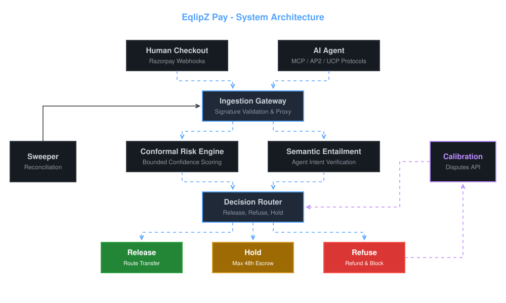
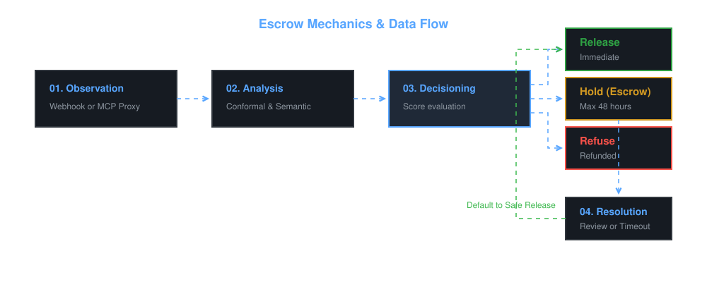

<a id="readme-top"></a>


<!-- PROJECT LOGO -->
<br />
<div align="center">
  <a href="https://github.com/itzsouravkumar/Eqlipzpay">
    
  </a>

  <h1 align="center">EqlipZ Pay</h1>

  <p align="center">
    A Trust Layer for Payments Made by Humans and AI Agents
    <br />
    <br />
  </p>
</div>

<!-- TABLE OF CONTENTS -->
<details>
  <summary>Table of Contents</summary>
  <ol>
    <li>
      <a href="#about-the-project">About The Project</a>
      <ul>
        <li><a href="#built-with">Built With</a></li>
      </ul>
    </li>
    <li>
      <a href="#architecture--data-flow">Architecture & Data Flow</a>
    </li>
    <li>
      <a href="#getting-started">Getting Started</a>
      <ul>
        <li><a href="#prerequisites">Prerequisites</a></li>
        <li><a href="#installation">Installation</a></li>
      </ul>
    </li>
    <li><a href="#roadmap">Roadmap</a></li>
    <li><a href="#license">License</a></li>
    <li><a href="#contact">Contact</a></li>
  </ol>
</details>

<!-- ABOUT THE PROJECT -->
## About The Project

EqlipZ Pay is risk and trust middleware for digital payments, built to mitigate settlement risk for **Razorpay Route** and AI agent protocols (AP2, UCP, MCP). It replaces binary approve/decline systems with a reversible, mathematically bounded **Hold** state (max 48h) for ambiguous transactions, powered by continuous calibration.

Rather than forcing a binary approve/decline decision, EqlipZ Pay holds funds for a maximum of 48 hours while maintaining rigorous statistical guarantees on accuracy.

<p align="right">(<a href="#readme-top">back to top</a>)</p>

### Built With

* [![Python][python-shield]][python-url]
* [![FastAPI][fastapi-shield]][fastapi-url]
* [![Scikit-Learn][scikit-shield]][scikit-url]
* [![Pandas][pandas-shield]][pandas-url]
* [![Render][render-shield]][render-url]

<p align="right">(<a href="#readme-top">back to top</a>)</p>

<!-- ARCHITECTURE AND DATA FLOW -->
## Architecture & Data Flow

EqlipZ Pay relies on highly decoupled services to intercept and evaluate payment authorizations in real-time.

<p align="center">
  
</p>

<p align="center">
  
</p>

<p align="right">(<a href="#readme-top">back to top</a>)</p>

<!-- GETTING STARTED -->
## Getting Started

To get a local copy up and running follow these simple example steps.

### Prerequisites

* Python 3.10+
* Git
* A Razorpay Developer Account

### Installation

1. Clone the repo
   ```sh
   git clone https://github.com/itzsouravkumar/Eqlipzpay.git
   ```
2. Navigate into the directory and create a virtual environment
   ```sh
   cd EqlipZPay
   python -m venv venv
   source venv/bin/activate
   ```
3. Install dependencies
   ```sh
   pip install -r requirements.txt
   ```
4. Enter your API credentials in `config/razorpay_keys.env`
   ```sh
   RAZORPAY_KEY_ID='YOUR_KEY_ID'
   RAZORPAY_KEY_SECRET='YOUR_KEY_SECRET'
   ```
5. Run the application
   ```sh
   uvicorn main:app --host 0.0.0.0 --port 10000 --reload
   ```

<p align="right">(<a href="#readme-top">back to top</a>)</p>

<!-- ROADMAP -->
## Roadmap

- [x] Initial Project Scaffolding
- [x] Integrate Conformal Risk Engine
- [ ] Implement Semantic Entailment validation for AI agents
- [ ] Establish feedback loop with Razorpay Disputes API
- [ ] Production deployment on Render

<p align="right">(<a href="#readme-top">back to top</a>)</p>

<!-- LICENSE -->
## License

Distributed under a Proprietary License. Developed exclusively for the Razorpay AI Buildathon 2026.

<p align="right">(<a href="#readme-top">back to top</a>)</p>

<!-- CONTACT -->
## Contact

Sourav Kumar - [itzsouravkumar](https://github.com/itzsouravkumar)

Project Link: [https://github.com/itzsouravkumar/Eqlipzpay](https://github.com/itzsouravkumar/Eqlipzpay)

<p align="right">(<a href="#readme-top">back to top</a>)</p>

<!-- MARKDOWN LINKS & IMAGES -->
[python-shield]: https://img.shields.io/badge/Python-3776AB?style=for-the-badge&logo=python&logoColor=white
[python-url]: https://python.org/
[fastapi-shield]: https://img.shields.io/badge/FastAPI-009688?style=for-the-badge&logo=fastapi&logoColor=white
[fastapi-url]: https://fastapi.tiangolo.com/
[scikit-shield]: https://img.shields.io/badge/scikit--learn-F7931E?style=for-the-badge&logo=scikit-learn&logoColor=white
[scikit-url]: https://scikit-learn.org/
[pandas-shield]: https://img.shields.io/badge/pandas-150458?style=for-the-badge&logo=pandas&logoColor=white
[pandas-url]: https://pandas.pydata.org/
[render-shield]: https://img.shields.io/badge/Render-46E3B7?style=for-the-badge&logo=render&logoColor=white
[render-url]: https://render.com/
