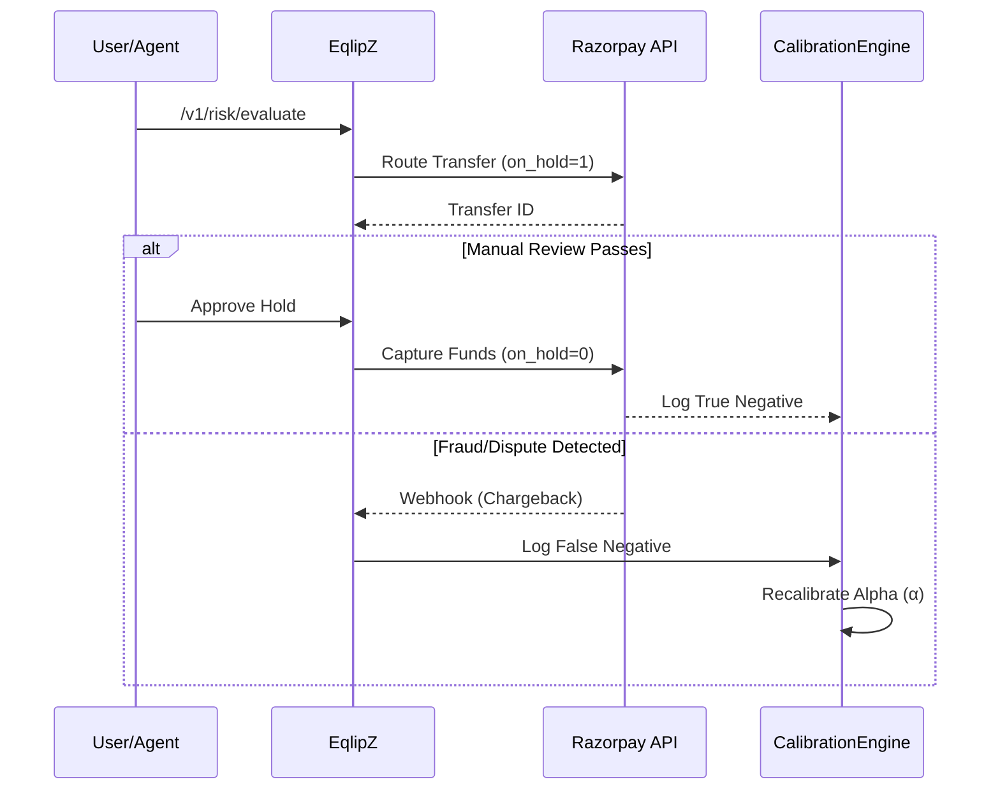

<a id="readme-top"></a>

<!-- PROJECT LOGO -->
<br />
<div align="center">
  <a href="https://github.com/itzsouravkumar/Eqlipzpay">
    
  </a>

  <h1 align="center">EqlipZ Pay</h1>

  <p align="center">
    The Agentic Payment Trust & Risk Control Plane
    <br />
    <br />
  </p>
</div>

<!-- TABLE OF CONTENTS -->
<details>
  <summary>Table of Contents</summary>
  <ol>
    <li>
      <a href="#about-the-project">About The Project</a>
      <ul>
        <li><a href="#built-with">Built With</a></li>
      </ul>
    </li>
    <li>
      <a href="#architecture--data-flow">Architecture & Data Flow</a>
    </li>
    <li>
      <a href="#getting-started">Getting Started</a>
      <ul>
        <li><a href="#prerequisites">Prerequisites</a></li>
        <li><a href="#installation">Installation</a></li>
      </ul>
    </li>
    <li><a href="#roadmap">Roadmap</a></li>
    <li><a href="#license">License</a></li>
    <li><a href="#contact">Contact</a></li>
  </ol>
</details>

<!-- ABOUT THE PROJECT -->
## About The Project

EqlipZ Pay is the missing trust layer for the AI economy, functioning as an **Agentic Payment Trust & Risk Control Plane**. Existing gateways like Razorpay and Stripe were built for deterministic human inputs. But when an AI agent initiates a transaction, it operates probabilistically—meaning it can hallucinate, misunderstand user intent, or fall victim to prompt injection.

EqlipZ Pay mathematically guarantees that when an AI spends money, it aligns precisely with the user's instructions. By calculating financial exposure (E*) based on conformal fraud probabilities, semantic intent alignment, and continuous agent trust models, we translate probabilistic AI behavior into deterministic, secure payment rails. 

For ambiguous or high-exposure transactions, EqlipZ Pay issues a **Hold** (reserving funds without immediate capture), rather than forcing a binary approve/decline decision.

<p align="right">(<a href="#readme-top">back to top</a>)</p>

### Built With

* [![Python][python-shield]][python-url]
* [![FastAPI][fastapi-shield]][fastapi-url]
* [![Scikit-Learn][scikit-shield]][scikit-url]
* [![Pandas][pandas-shield]][pandas-url]
* [![Groq][groq-shield]][groq-url]
* [![Render][render-shield]][render-url]

<p align="right">(<a href="#readme-top">back to top</a>)</p>

<!-- ARCHITECTURE AND DATA FLOW -->
## Architecture & Data Flow

EqlipZ Pay relies on highly decoupled core engines to intercept and evaluate payment authorizations in real-time, backed by live Razorpay integrations.

```mermaid
graph TD
    A[Agent Checkout Request] --> G[Trust Gateway HMAC]
    G -->|Valid Signature| B[Conformal Risk Engine]
    B -->|Provides P(Fraud)| C[Intent Firewall]
    C -->|Verifies Alignment| D[Contextual Trust Graph]
    D -->|Applies Trust Adj| E[Exposure Engine]
    E -->|Calculates E* Loss| F[Policy Control Plane]
    
    F -->|E* < L1| J((RELEASE))
    F -->|L1 < E* < L2| K((HOLD))
    F -->|E* > L3| L((REFUSE))

    J -->|Live Transfer| M[Razorpay Route API]
    K -->|on_hold=1| M
    L -->|Live Refund| N[Razorpay Refund API]
    
    O[Razorpay Disputes Webhook] -->|Ground Truth| P[Calibration Job]
    P -->|Updates Alpha| B

    style B fill:#e6f2ff,stroke:#0066cc,stroke-width:2px
    style C fill:#fff2e6,stroke:#ff9933,stroke-width:2px
    style E fill:#e6ffe6,stroke:#00cc00,stroke-width:2px
    style F fill:#f2e6ff,stroke:#9933ff,stroke-width:2px
    style G fill:#f0f0f0,stroke:#666,stroke-width:2px
```

### Risk Calculation (Exposure E*)

The central mechanism of the 2.0 Engine is the **Exposure Score (E*)**, calculated dynamically per transaction based on real-time database metrics:

```text
E* = P(Fraud) × LGD × Amount × IntentRisk × TrustAdjustment × NetworkRisk × LiquidityPenalty
```

Where:
- `P(Fraud)`: Mathematically bounded fraud probability generated by Split Conformal Prediction.
- `IntentRisk`: Penalty applied if the agent's cart semantically misaligns with the user's intent.
- `TrustAdjustment`: Continuous reputation score for the specific AI Agent Vendor.
- `NetworkRisk` / `LiquidityPenalty`: Dynamic metrics fetched from the SQLite control plane.

### Feedback & Auto-Reconciliation Loop



<p align="right">(<a href="#readme-top">back to top</a>)</p>

<!-- GETTING STARTED -->
## Getting Started

To get a local copy up and running follow these simple example steps.

### Prerequisites

* Python 3.10+
* Git
* A Razorpay Developer Account (Live or Test mode keys)
* (Optional) A [Groq API Key](https://console.groq.com/) for LLM-backed semantic evaluation

### Installation

1. Clone the repo
   ```sh
   git clone https://github.com/itzsouravkumar/Eqlipzpay.git
   ```
2. Navigate into the directory and create a virtual environment
   ```sh
   cd EqlipZPay
   python -m venv venv
   source venv/bin/activate
   ```
3. Install dependencies
   ```sh
   pip install -r requirements.txt
   ```
4. Enter your API credentials in `config/razorpay_keys.env` or export them as environment variables. **Mock environments are disabled; the system requires real keys to function.**
   ```sh
   RAZORPAY_KEY_ID='YOUR_KEY_ID'
   RAZORPAY_KEY_SECRET='YOUR_KEY_SECRET'
   GROQ_API_KEY='YOUR_GROQ_KEY'       # Optional: enables LLM-backed semantic engine
   ```
5. Run the application
   ```sh
   uvicorn main:app --host 0.0.0.0 --port 10000 --reload
   ```

<p align="right">(<a href="#readme-top">back to top</a>)</p>

### Usage Example

EqlipZ Pay intercepts payment events and scores them using conformal risk and semantic intent analysis. You can test it by POSTing directly to the evaluation endpoint.

```bash
curl -X POST http://127.0.0.1:10000/v1/risk/evaluate \
  -H "Content-Type: application/json" \
  -H "X-EqlipZ-Signature: <hmac-sha256>" \
  -H "X-EqlipZ-Timestamp: <timestamp>" \
  -d '{
    "transaction": {
      "amount": 800.00,
      "is_international": true
    },
    "source": "AGENT_MCP",
    "user_intent": "Buy a nice chair.",
    "cart": [
      {"name": "Herman Miller Gaming Chair", "price": 800.00, "quantity": 1}
    ]
  }'
```

The system evaluates the semantic mismatch, calculates the loss exposure, and returns the actionable decision:

```json
{
  "decision": "HOLD",
  "risk": {
    "fraud": 0.1675,
    "intent": 0.5,
    "graph": 1.25,
    "uncertainty": 0.05
  },
  "exposure": {
    "gross": 800.0,
    "estimated_loss": 50.25
  },
  "policy": {
    "reserve_percent": 0,
    "hold_duration_hours": 12,
    "step_up_required": false,
    "review_required": true
  },
  "reason_codes": [
    "MODERATE_EXPOSURE"
  ]
}
```

<p align="right">(<a href="#readme-top">back to top</a>)</p>

<!-- ROADMAP -->
## Roadmap

- [x] Initial Project Scaffolding (schemas, ingestion, dashboard)
- [x] Conformal Risk Engine with MAPIE calibration
- [x] Contextual Trust Graph for Agent Vendors
- [x] Intent Firewall for deterministic & semantic checks
- [x] Exposure Engine & Policy Control Plane
- [x] LLM-backed Semantic Engine via Groq
- [x] Live Razorpay Route API (Settlement Holds)
- [x] Live Razorpay Refunds API
- [x] Live Razorpay Disputes API Webhook integration
- [x] Feedback Loop — CalibrationJob
- [x] Cryptographic Trust Gateway (HMAC Signatures)
- [x] Reconciliation Sweeper (background hold auto-release)
- [x] MCP/AP2/UCP Agent Proxy endpoint
- [x] Interactive Dashboard with live stats
- [x] Production deployment on Render

<p align="right">(<a href="#readme-top">back to top</a>)</p>

<!-- LICENSE -->
## License

Distributed under a Proprietary License. Developed exclusively for the Razorpay AI Buildathon 2026.

<p align="right">(<a href="#readme-top">back to top</a>)</p>

<!-- CONTACT -->
## Contact

Sourav Kumar - [itzsouravkumar](https://github.com/itzsouravkumar)

Project Link: [https://github.com/itzsouravkumar/Eqlipzpay](https://github.com/itzsouravkumar/Eqlipzpay)

<p align="right">(<a href="#readme-top">back to top</a>)</p>

<!-- MARKDOWN LINKS & IMAGES -->
[python-shield]: https://img.shields.io/badge/Python-3776AB?style=for-the-badge&logo=python&logoColor=white
[python-url]: https://python.org/
[fastapi-shield]: https://img.shields.io/badge/FastAPI-009688?style=for-the-badge&logo=fastapi&logoColor=white
[fastapi-url]: https://fastapi.tiangolo.com/
[scikit-shield]: https://img.shields.io/badge/scikit--learn-F7931E?style=for-the-badge&logo=scikit-learn&logoColor=white
[scikit-url]: https://scikit-learn.org/
[pandas-shield]: https://img.shields.io/badge/pandas-150458?style=for-the-badge&logo=pandas&logoColor=white
[pandas-url]: https://pandas.pydata.org/
[groq-shield]: https://img.shields.io/badge/Groq-000000?style=for-the-badge&logo=groq&logoColor=white
[groq-url]: https://groq.com/
[render-shield]: https://img.shields.io/badge/Render-46E3B7?style=for-the-badge&logo=render&logoColor=white
[render-url]: https://render.com/
